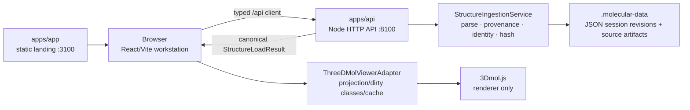
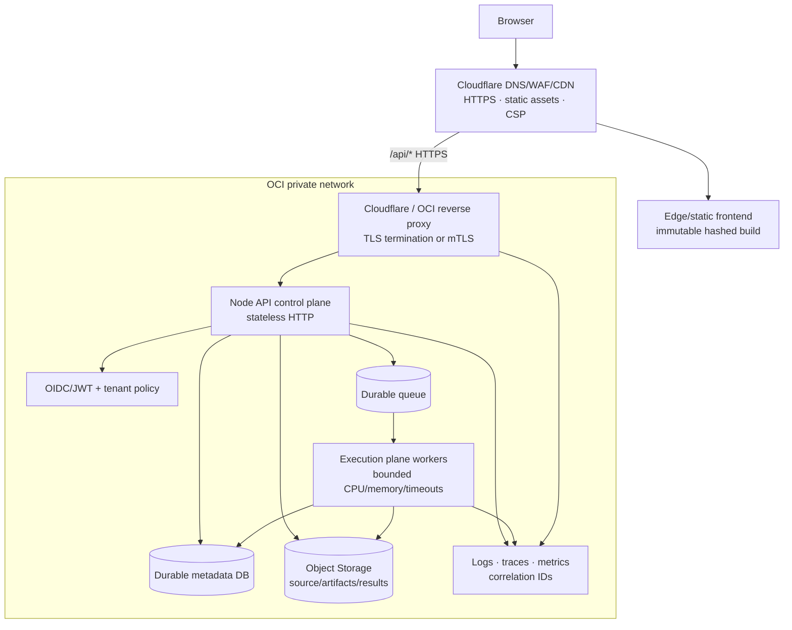

# P0-PERF architecture and deployment decision

## Current workstation architecture

The backend remains the scientific authority. Renderer indices, labels, surfaces, camera state, and WebGL handles are presentation/runtime state only. The P0 change does not alter canonical identity, topology, coordinate, provenance, or docking contracts.

## Target production topology

The control plane accepts authenticated, bounded requests, records immutable job/input metadata, and returns job state. The execution plane performs expensive ingestion, docking, surface generation, or other compute in isolated workers. It must never make renderer state or a process-local map the durable scientific authority. Object Storage carries exact source bytes and derived artifacts; the database carries revisions, provenance, leases, and job state; the queue carries work, retry, and cancellation fencing.

## Separation rules

| Boundary | Authoritative owner | P0 disposition |
| --- | --- | --- |
| Molecular identity, topology, coordinates, source hash | API/domain | Preserved; 4V6F hash unchanged after optimization |
| Style, visibility, labels, camera, overlays | Browser presentation state | Fine-grained dirty classes; camera and transient interaction avoid full model restyles |
| Viewer handles and renderer indices | `ThreeDMolViewerAdapter` | Ephemeral only; not serialized into project/session identity |
| User/session metadata | Durable database in production | Current JSON files are workstation-only |
| Exact source and generated artifacts | Object Storage in production | Current local artifact store is workstation-only |
| Expensive scientific/compute jobs | Isolated worker pool | Docking execution remains unavailable; no D3 scoring/search was implemented |

## Security and hardening findings

| Severity | Finding | Current evidence | Required disposition |
| --- | --- | --- | --- |
| P0 | No authentication/authorization on API routes | `apps/api/src/server.ts` exposes project, command, upload, and D2 routes without identity checks | Block public deployment; add OIDC/JWT and tenant/object authorization at the control plane |
| P0 | Wildcard CORS | API emits `access-control-allow-origin: *` | Replace with environment-specific allow-list and credential policy before production |
| P0 | Unbounded JSON request accumulation | `readJson()` concatenates all chunks without a byte ceiling | Add bounded body reader before public exposure; multipart has separate limits but must remain enforced |
| P0 | Process-local authority/storage | command history, ingestion maps, and source artifact memory are process-local; files are local JSON | Move metadata/artifacts/jobs to durable shared services for multi-instance operation |
| P0 | Async completion/cancellation fencing | command jobs are process-local and cancellation does not provide a distributed lease/fence | Require durable job state, worker lease tokens, idempotency, and terminal-state compare-and-swap |
| P1 | Bind/exposure configuration | Node API listens without an explicit host; local default can expose on all interfaces | Default local development to loopback; explicitly bind private OCI interface behind the proxy in production |
| P1 | Dependency advisories | `npm ci` audit reports 5 advisories: 3 moderate, 1 high, 1 critical | Triage lockfile and 3Dmol transitive/runtime risk before release |
| P1 | Bundle/dependency warning | 3Dmol emits an `eval` warning; main bundle is ~1.4 MB minified | Pin/audit dependency, isolate it in a documented bundle boundary, and code-split the workstation shell |

## Deployment-readiness decision

**Workstation-ready:** the protected UI-D0 baseline, P0 performance measurements, renderer dirty-class fixes, local API, and regression suite are reproducible from the P0 branch.

**Production-not-ready:** the target OCI/Cloudflare topology is documented but not claimed as deployed. Authentication, origin restriction, request limits, durable multi-instance storage, queue/worker fencing, observability, and dependency remediation remain release gates. The correct next milestone is infrastructure/security hardening, not D3 scoring/search.
